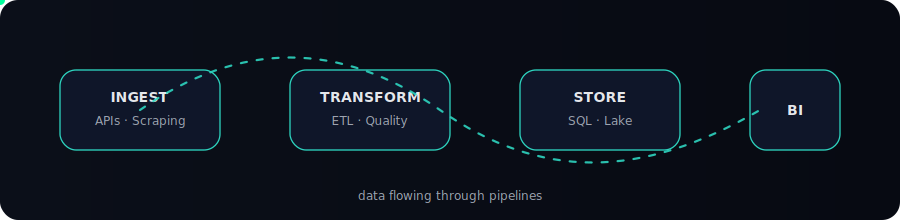

 

<table align="center" width="92%">
<tr>
<td align="center">

<h3>🧰 Tech Stack</h3>

<b>Data & Analytics</b> 
<code>SQL</code> · <code>Python</code> · <code>Pandas</code> · <code>EDA</code> · <code>Feature Engineering</code>

<b>Data Engineering</b> 
<code>ETL Pipelines</code> · <code>Data Modeling</code> · <code>Web Scraping</code> · <code>APIs</code>

<b>Big Data / BI</b> 
<code>Spark (basics)</code> · <code>Power BI</code> · <code>Tableau</code>

<b>AI / ML Foundations</b> 
<code>Scikit-learn</code> · <code>Regression</code> · <code>Classification</code> · <code>ML Pipelines</code>

<b>Cloud & Tools</b> 
<code>Git</code> · <code>GitHub</code> · <code>Docker (basics)</code> · <code>Databricks CE</code> · <code>AWS S3</code>

<h3>💼 Experience</h3>

<b>Data Analyst</b> — <i>Comcast / Media & AdTech</i> 
Validated ad-delivery schedules and revenue-impacting discrepancies 
Worked with operations & business stakeholders

<b>Junior Data Analyst</b> — <i>Event & Entertainment Analytics</i> 
Built reports for large-scale electronic music events 
SQL analysis · Dashboards · Actionable insights

 

<!-- CREATIVE BADGE ROW -->

  
  
  

 

<!-- PIPELINE MOVED BELOW EXPERIENCE -->

</td>
</tr>
</table>

 
